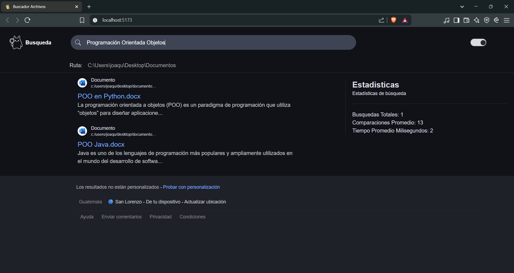

# Buscador de Documentos - AVL

Aplicación web que permite buscar documentos locales (`.pdf`) utilizando un motor de búsqueda basado en árboles AVL. Su diseño está inspirado en el buscador de Google.

---

## Funcionalidades

- Búsqueda de palabras clave en documentos locales
- Indexación eficiente mediante árboles AVL
- Visualización de resultados con fragmento del contenido
- Estadísticas por búsqueda (tiempo, comparaciones)
- Interfaz moderna y responsiva en modo oscuro

---

## Tecnologías utilizadas

### 🔹 Frontend
- React + Vite
- TailwindCSS para estilos utilitarios y diseño responsivo
- Modo oscuro personalizado (clases de utilidad y temas)
- Iconos y recursos gráficos en SVG y WebP

### 🔹 Backend
- Java (Spring Boot)
- Lógica de búsqueda con estructura de árbol AVL
- Indexación, control de archivos y métricas

---

## Estructura del proyecto

```
buscador-de-documentos-avl/
├── busqueda-avl-frontend/   # Interfaz de usuario en React
├── busquedas-avl-backend/   # Backend en Java (Spring)
└── Documentos a probar/     # Archivos de ejemplo para pruebas
```

---

## Cómo ejecutar

### 🔸 Frontend
```bash
cd busqueda-avl-frontend
npm install
npm run dev
```

### 🔸 Backend
```bash
cd busquedas-avl-backend
# Compilar y ejecutar con tu IDE
```

---

## Captura de pantalla



---

## Autor

- Joaquín – [GitHub](https://github.com/Hoakin26)
